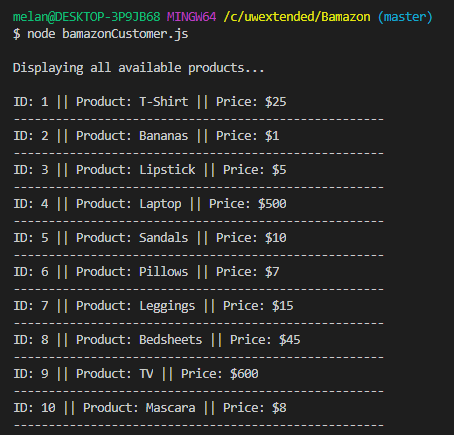

# Project: Bamazon

## Overview

In this project, I'll be creating an Amazon-like storefront with the MySQL. The app will take in orders from customers and deplete stock from the store's inventory. 

### Technology used:

Visual Studio Code - text editor

Node.js

NPM Packages:

* Express (https://www.npmjs.com/package/express)
* Inquirer (https://www.npmjs.com/package/inquirer)
* MySql (https://www.npmjs.com/package/mysql)

### How to start an order

In the command line, type in the following to see the list of products:

`node bamazonCustomer.js`

Once the list is displayed, users could choose a product they'd like to buy by typing in the product's ID.
  
  

The user will then be able to enter the amount they'd like to purchase of that product.

        * If the user enters an amount that is under the stock quantity, the terminal will display the total price then tell them to proceed to checkout.

When the user enters an amount that is over the stock quantity, the terminal will log the current stock amount and that there's an insufficient quantity of that product. The user will then have the option to make a different purchase if they wish.

  
